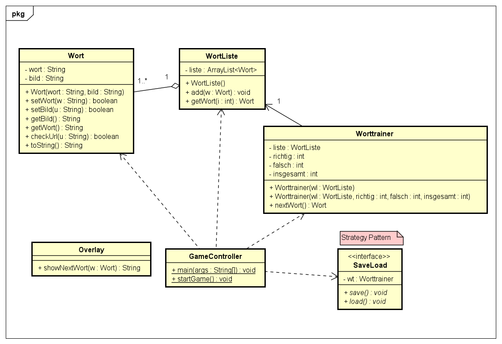

# WorttrainerReloaded
**Autor**: Benjamin Princ

**Datum**: 11.10.2024

## Einleitung
Ziel ist es den Worttrainer mit dem jetzigen Wissen neu umzusetzen und mit JOptionPane
eine grafische Oberfläche zu realisieren.

## Umsetzung
### UML-Diagramm

### Technische Umsetzung