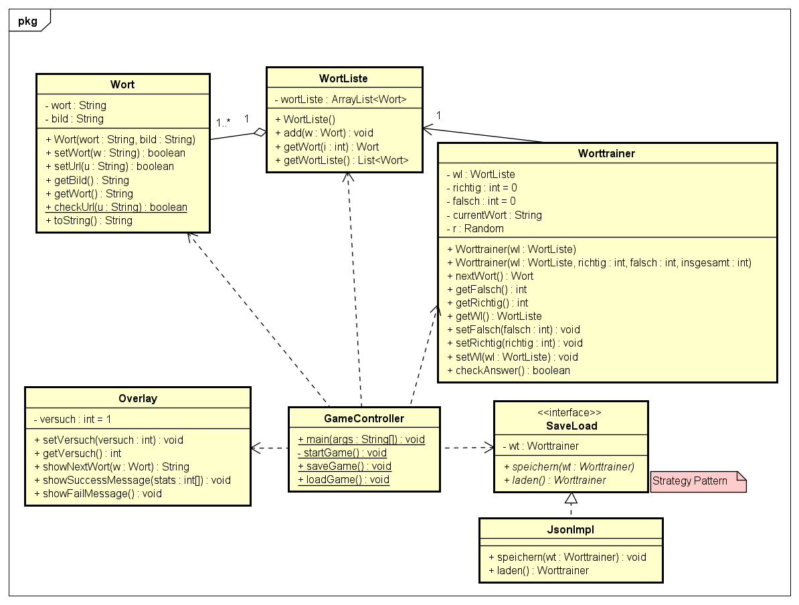

# WorttrainerReloaded
**Autor**: Benjamin Princ

**Datum**: 13.10.2024

## Einleitung
Ziel ist es den Worttrainer mit dem jetzigen Wissen neu umzusetzen und mit JOptionPane
eine grafische Oberfläche zu realisieren.

## Umsetzung
### UML-Diagramm

### Technische Umsetzung
Zu Start des Spiels wird ein neues [Worttrainer](/src/main/java/at/bprinc/Worttrainer.java) Objekt 
mit einer vorgegebenen Wortliste erstellt.
Die Benutzeroberfläche bietet dann die Methode ein altes Spiel zu laden, bzw das jetzige zu speichern.

#### Verwendete Technologien
Die Benutzeroberfläche (GUI) wird mit **JOptionPane** umgesetzt.

Das Speichern und Laden ist auf Basis des Strategy Patterns aufgebaut und implementiert derzeit **JSON**.

#### Benutzeroberfläche
Im Programm Fenster wird das Bild des gesuchten Wortes, ein Eingabefeld und vier Buttons angezeigt:
* **Speichern**: Speichert das Spiel unter einem fixen Speicherpfad
* **Laden**: Lädt ein vergangenes Spiel aus dem fixen Speicherpfad
* **OK**: Sendet die Nutzereingabe ab
* **Cancel**: Beendet das Programm

Außerdem gibt es, nach dem 1. Versuch für ein Wort, über dem Bild einen Text,
welcher die Anzahl der Versuche für das derzeitige Wort anzeigt.

### Automatisiertes Testen
Mithilfe von JUnit werden vordefinierte Tests ausgeführt. 
Getestet werden die [Wort-Klasse](/src/main/java/at/bprinc/Wort.java) und
[Wort-Trainer](/src/main/java/at/bprinc/Worttrainer.java) Funktionalitäten.